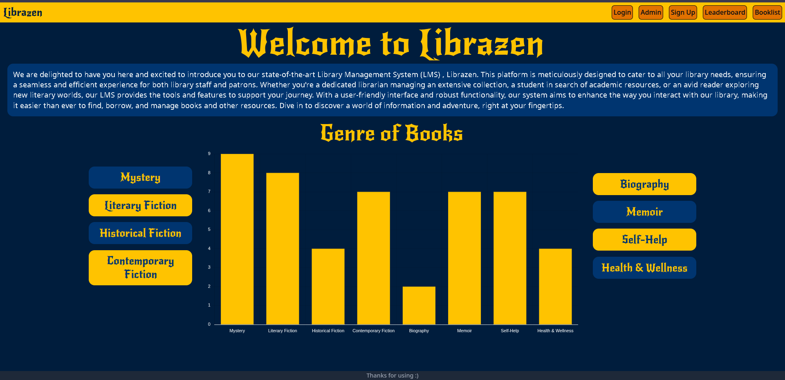
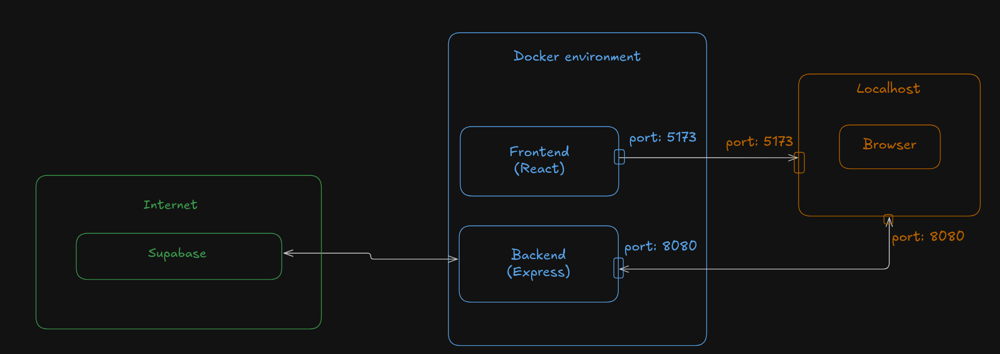

# Librazen


Librazn is Library Management System ment to aid in the day to day functionality of a Library and also act as a website for the Library. The functionality that Librazen help with are:

1. Allowing users the variety of books present in the library
2. Providing admins with an interface to help manage the borrowing and returning of books
3. Maintinaing leaderboard of top 10 users who have read the most books
4. Providing users with an interface to sign up to the library.

## Development Setup


To aid the development of the project among developers, the project is dockerized using node images from docker hub. To start the project, you need to setup docker and navigate to the root directory of the project and input the following command.

```
docker compose up
```

open `localhost:5173` on your browser to view the project
